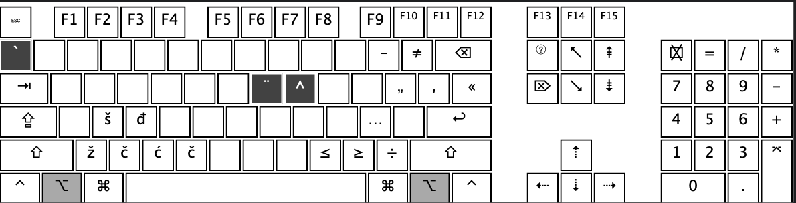

#### Croatian pro
Keyboard layout for Croatian language on macOS, based on the "Polski Programisty" layout.  
It includes all special characters for Croatian, implemented in the same way as special characters for Polish.
So, for example, to type `č` you press `Alt + c`, to type `ž` you press `Alt + z`, and so on.

`Alt + letter` gives you special character.

### Usage
To make this keyboard layout available for all users on your Mac, copy the bundle file to:
```
/Library/Keyboard Layouts/
```

To make it available only for your user account, copy it to:
```
~/Library/Keyboard Layouts/
```

To do this, open Finder, then from the top menu bar select `Go` → `Go to Folder`,
and paste the desired path.

### Layout
You can find the full layout in the folder named after the keyboard layout.

Here is an example for QWERTY:


If you want to change or modify based on you preferences you can use [Ukelele](https://software.sil.org/ukelele/) application.

### How to check package
If you're unsure (since it's the internet and anyone can put anything inside a bundle file), you can check the contents first.  
To do this, right-click the bundle file and select **"Show Package Contents"**.
